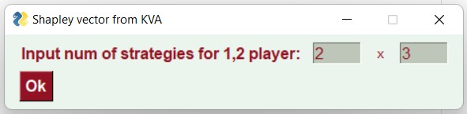

# game-theory
4th course, labs, GUI

## About matrix antagonistic game
Goal is to find the solution of a matrix antagonistic game using a linear programming problem (simplex tables).

## About Shapley vector
Goal is to find the Shapley vector as a solution to a cooperative game.

